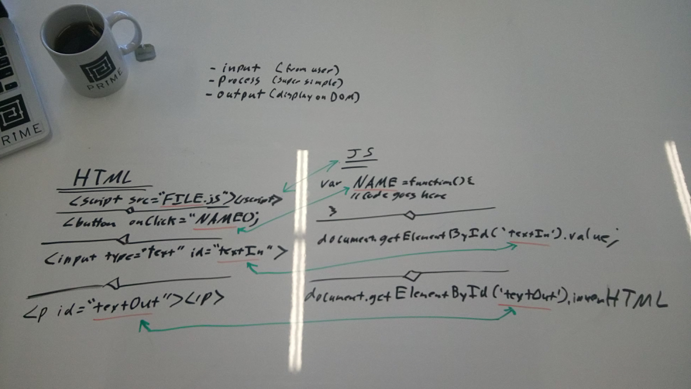

Append to Dom JS Example
========================

A simple HTML/JS example that takes input from the user and appends text to the DOM using vanilla JavaScript.



Files:
------
* index.html
* domAppend.js in a "scripts" folder

In Index.html will need to have the js file sourced in.

```HTML
<script src="scripts/domAppend.js"></script>
```

The HTML will also have an input element for the user to place text and button that calls the "appendToDom" function in the js file.

```html
<input type="text" id="textIn" value="">
<button onClick='appendToDom()'>Append Text</button>
```

Note that the "id" of the text element is "textIn". We'll be using this id tag in the js later to get the user input:

```JavaScript
// get user input
var textInput = document.getElementById( 'textIn' ).value;
```

The HTML file also has a p element with an id of "textOut".

```html
<p id='textOut'></p>
```

Originally it has no text, but when the button is clicked and the appendToDom function is run, we'll take the user input from the input element, store it in a variable, and put it in a new p element with "you typed: " in front of it. Then we'll append this to the "innerHTML" of the "textOut" element.

```JavaScript
// get user input
var textInput = document.getElementById( 'textIn' ).value;
// display on DOM
document.getElementById( 'textOut' ).innerHTML += '<p>You typed: ' + textInput + '</p>';
// clear input field
document.getElementById( 'textIn' ).value='';
```
